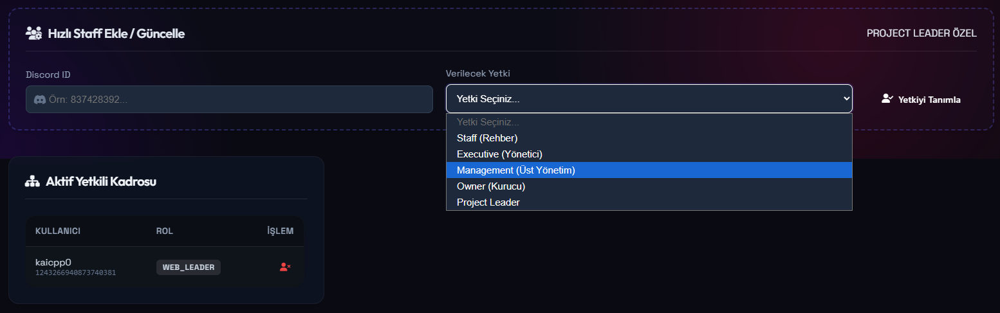

 

# 🛡️ Kai Web 
### FiveM Sunucuları için Discord Entegreli Web Yönetim Sistemi

  <a href="#-genel-bakış">Genel Bakış</a> •
  <a href="#-ekran-görüntüleri">Görseller</a> •
  <a href="#-sistem-özellikleri">Özellikler</a> •
  <a href="#-lisanslama-sistemi">Lisans</a> •
  <a href="#-iletişim">İletişim</a>

  
  
  
   
  
  

---

## <i class="fa-solid fa-circle-info"></i> Genel Bakış

<b>Kai Web Management</b>, FiveM sunucularının Discord tarafını <b>web tabanlı, merkezi ve güvenli</b> bir panel üzerinden yönetmek için geliştirilmiş, profesyonel, <b>lisanslı ve ücretli</b> bir yazılımdır.

Rütbelendirme, rol izinleri, whitelist ve yetkili başvuru sistemleri gibi kritik yönetim süreçlerini <b>tam kontrol, detaylı kayıt (log) ve hiyerarşik yetkilendirme</b> mantığıyla sunarak sunucu yönetim yükünü hafifletir.

<h3>🎯 Proje Hedefi: 35 GitHub Star</h3>

Bu profesyonel yönetim aracının gelişimini desteklemek için bir ⭐️ bırakabilirsiniz.

---

## 📸 Ekran Görüntüleri

Modern "Liquid Glass" tasarım yaklaşımıyla hazırlanmış yönetim panelinden kareler.

<table align="center">
  <tr>
    <td align="center" width="50%">
        
         <b>Ana Kontrol Paneli</b>
    </td>
    <td align="center" width="50%">
        
         <b>Kullanıcı & Rol Yönetimi</b>
    </td>
  </tr>
  <tr>
    <td align="center" width="50%">
        
         <b>Detaylı Log Kayıtları</b>
    </td>
    <td align="center" width="50%">
        
         <b>Başvuru & Whitelist Yönetimi</b>
    </td>
  </tr>
</table>

---

## <i class="fa-solid fa-layer-group"></i> Sistem Özellikleri

Yönetim süreçlerinizi kolaylaştıran temel modüller.

<table>
  <tr>
    <td width="50%" valign="top">
      <h3>🌐 Web Yönetim Paneli</h3>
      <ul>
        <li>Tamamen web tabanlı merkezi yönetim.</li>
        <li>Yetki seviyesine bağlı dinamik erişim kontrolü.</li>
        <li>Göz yormayan modern ve sade "Liquid Glass" arayüz.</li>
        <li>Socket ile güçlendirilmiş gerçek zamanlı veri akışı.</li>
      </ul>
    </td>
    <td width="50%" valign="top">
      <h3>👮 Rütbe & Rol Yönetimi</h3>
      <ul>
        <li>FiveM sunucuları için özelleştirilmiş hiyerarşi.</li>
        <li>Panel üzerinden anlık Discord rol atama/alma.</li>
        <li>Rol bazlı yetki sınırlandırmaları (Alt/Üst yönetim).</li>
        <li>Yetkili hiyerarşi ve işlem kontrolü.</li>
      </ul>
    </td>
  </tr>
  <tr>
    <td width="50%" valign="top">
      <h3>📋 Whitelist Sistemi</h3>
      <ul>
        <li>Oyuncular için entegre başvuru formu.</li>
        <li>Yetkililer için hızlı onay/red paneli.</li>
        <li>Başvuru durum takibi ve geçmişi.</li>
        <li>Tüm başvuruların arşivlenmesi.</li>
      </ul>
    </td>
    <td width="50%" valign="top">
      <h3>🛡️ Yetkili Başvuru Yönetimi</h3>
      <ul>
        <li>Özelleştirilebilir yetkili başvuru formları.</li>
        <li>Rütbeye özel değerlendirme ve oylama sistemi.</li>
        <li>Tek tıkla yetki verme ve geri alma işlemleri.</li>
        <li>Yetkili terfi/tenzil işlem kayıtları.</li>
      </ul>
    </td>
  </tr>
</table>

    <h3>📜 Gelişmiş Loglama & Kayıt Sistemi</h3>
    
Panel üzerindeki <b>TÜM</b> işlemler (kim, ne zaman, ne yaptı) otomatik olarak loglanır ve web panel üzerinden detaylıca filtrelenip görüntülenebilir. Hiçbir işlem gizli kalmaz.

---

## <i class="fa-solid fa-key"></i> Lisanslama Sistemi

  
<b>Kai Web Management lisans anahtarı ile korunan ticari bir yazılımdır.</b>

  <ul style="list-style-type: '🔑 ';">
    <li>Sistem yalnızca geçerli bir <b>lisans anahtarı</b> ile çalışır.</li>
    <li>Her FiveM sunucusu (IP/Domain) için <b>ayrı lisans</b> gereklidir.</li>
    <li>Lisans anahtarı olmadan sistem aktif edilemez ve başlatılamaz.</li>
    <li>Lisans ihlali tespit edildiğinde erişim kalıcı olarak kapatılır.</li>
  </ul>
  

    Israrla belirtmek isteriz ki; <b>Demo sürüm bulunmamaktadır.</b> 
    Satın alma öncesi detaylı bilgi, canlı gösterim ve sistem anlatımı için iletişime geçilmelidir.
  

---

## ⚖️ Yasal Uyarı & Telif Hakkı

  <h3>🚨 LİSANSLI YAZILIM UYARISI</h3>
  

    Bu yazılım tamamen lisanslıdır ve mülkiyeti korunmaktadır.
    İzinsiz kopyalanması, dağıtılması, paylaşılması, satılması, tersine mühendislik yapılması veya değiştirilmesi <b>kesinlikle yasaktır</b>.
  

  

    Tespit edilen ihlallerde doğrudan yasal işlem başlatılacaktır.
     <b>Adaletten çekinilmez.</b>
  

  Bu proje açık kaynak (open-source) değildir. Tüm hakları saklıdır.

---

## <i class="fa-solid fa-address-card"></i> İletişim

Satın alma, lisanslama detayları ve sistem hakkında kapsamlı bilgi almak için aşağıdaki kanallardan ulaşabilirsiniz.

  
  

---

  © 2026 Kai Web Management — Tüm Hakları Saklıdır. Güvenlik ve Performans İçin Tasarlandı.

